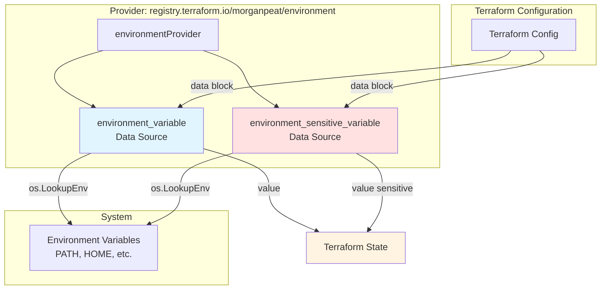
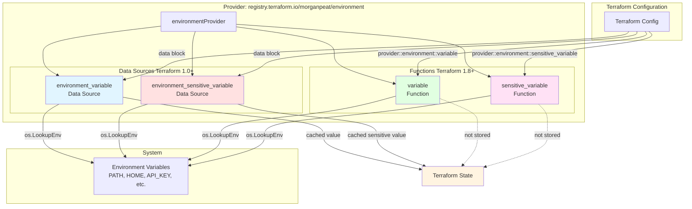
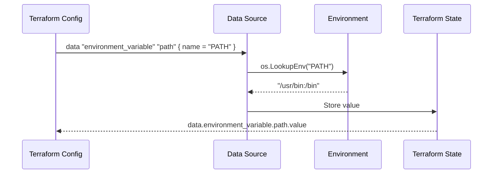
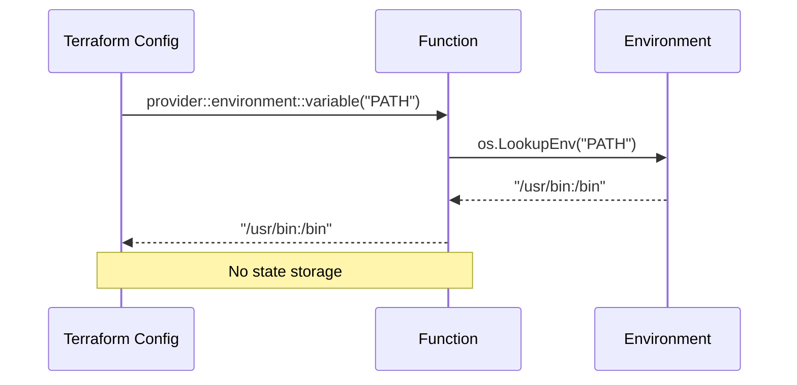
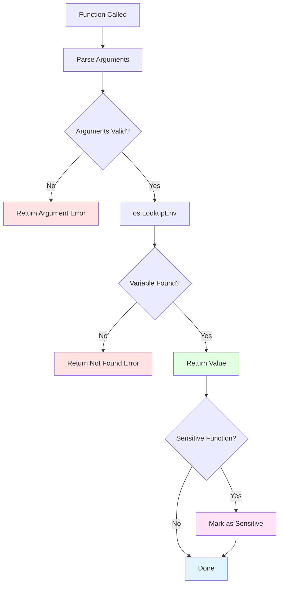
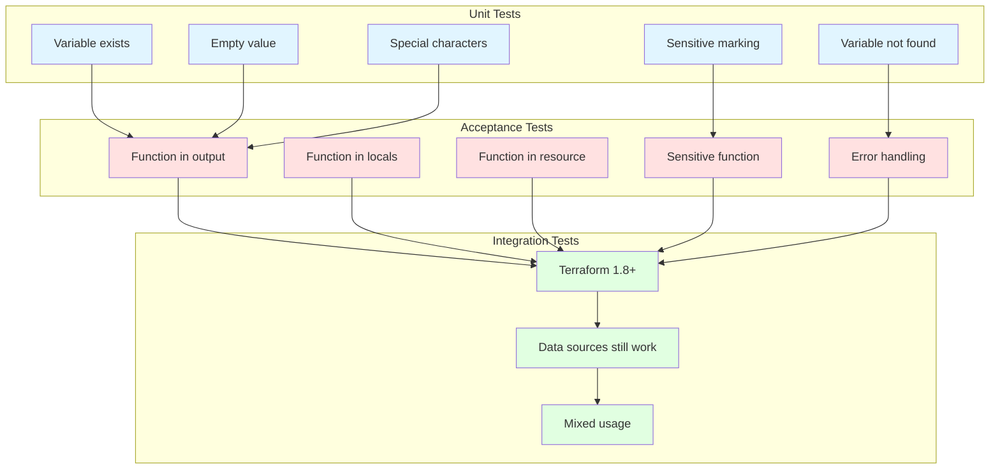
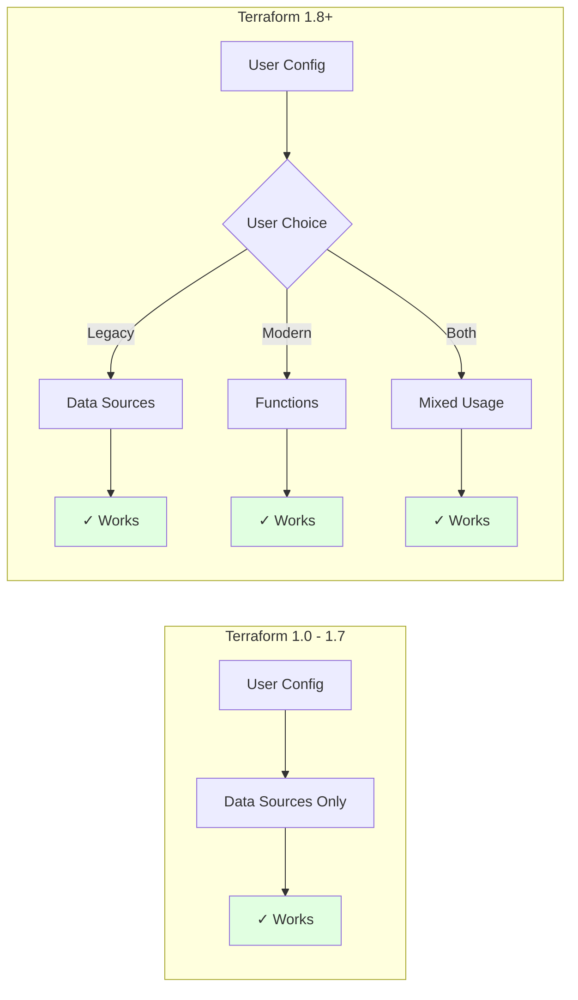

# Provider Architecture Diagram

## Current Architecture (Data Sources Only)



## Proposed Architecture (Data Sources + Functions)



## Usage Comparison

### Data Source Approach (Terraform 1.0+)



### Function Approach (Terraform 1.8+)



## Implementation Flow

```mermaid
graph LR
    subgraph "Phase 1: Core Implementation"
        A1[Add Functions method<br/>to provider.go]
        A2[Implement<br/>variable_function.go]
        A3[Implement<br/>sensitive_variable_function.go]
        A4[Add unit tests]
        
        A1 --> A2
        A2 --> A3
        A3 --> A4
    end
    
    subgraph "Phase 2: Testing"
        B1[Acceptance tests]
        B2[Integration testing]
        B3[Backward compatibility<br/>verification]
        
        A4 --> B1
        B1 --> B2
        B2 --> B3
    end
    
    subgraph "Phase 3: Documentation"
        C1[Update templates]
        C2[Create examples]
        C3[Generate docs]
        C4[Update README]
        
        B3 --> C1
        C1 --> C2
        C2 --> C3
        C3 --> C4
    end
    
    subgraph "Phase 4: Release"
        D1[Update CHANGELOG]
        D2[Create release notes]
        D3[Tag release]
        
        C4 --> D1
        D1 --> D2
        D2 --> D3
    end
    
    style A1 fill:#e1f5ff
    style A2 fill:#e1f5ff
    style A3 fill:#e1f5ff
    style A4 fill:#e1f5ff
    style B1 fill:#ffe1e1
    style B2 fill:#ffe1e1
    style B3 fill:#ffe1e1
    style C1 fill:#e1ffe1
    style C2 fill:#e1ffe1
    style C3 fill:#e1ffe1
    style C4 fill:#e1ffe1
    style D1 fill:#fff4e1
    style D2 fill:#fff4e1
    style D3 fill:#fff4e1
```



## File Structure

```
terraform-provider-environment/
├── internal/provider/
│   ├── provider.go                          # Updated: Add Functions() method
│   ├── provider_test.go                     # Existing
│   │
│   ├── variable_data_source.go              # Existing: Terraform 1.0+
│   ├── variable_data_source_test.go         # Existing
│   ├── sensitive_variable_data_source.go    # Existing: Terraform 1.0+
│   ├── sensitive_variable_data_source_test.go # Existing
│   │
│   ├── variable_function.go                 # New: Terraform 1.8+
│   ├── variable_function_test.go            # New
│   ├── sensitive_variable_function.go       # New: Terraform 1.8+
│   └── sensitive_variable_function_test.go  # New
│
├── examples/
│   ├── data-sources/                        # Existing examples
│   │   ├── environment_variable/
│   │   └── environment_sensitive_variable/
│   │
│   └── functions/                           # New examples
│       ├── environment_variable/
│       │   └── function.tf
│       └── environment_sensitive_variable/
│           └── function.tf
│
├── docs/
│   ├── data-sources/                        # Existing docs
│   │   ├── variable.md
│   │   └── sensitive_variable.md
│   │
│   └── functions/                           # New docs (auto-generated)
│       ├── variable.md
│       └── sensitive_variable.md
│
├── templates/
│   └── index.md.tmpl                        # Updated: Add functions section
│
├── DESIGN_FUNCTIONS.md                      # This design document
├── ARCHITECTURE_DIAGRAM.md                  # This file
└── README.md                                # Updated: Add functions example
```

## Error Handling Flow



## Testing Strategy



## Backward Compatibility



## Key Design Decisions Summary

| Decision | Rationale |
|----------|-----------|
| Two separate functions (variable, sensitive_variable) | Terraform function return types must be statically defined; cannot conditionally mark as sensitive |
| Keep existing data sources unchanged | Maintain backward compatibility with Terraform < 1.8 |
| Mirror data source naming | Consistency with existing API |
| Error on missing variable | Explicit failure prevents silent configuration errors |
| No state storage for functions | Functions are evaluated on-demand per Terraform design |
| Separate implementation files | Follows existing code organization patterns |
